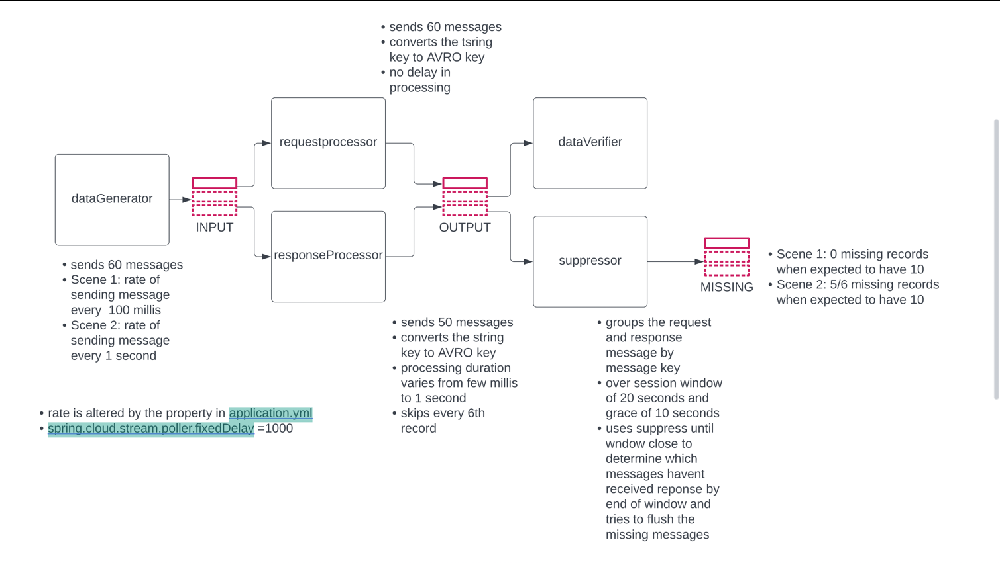

run infrastructure
```shell
docker-compose down && \
docker volume prune  -f && \
docker-compose  -f docker-compose.yml  \
        up -d schema-registry
```

run application
```shell
./gradlew clean bootRun
```
